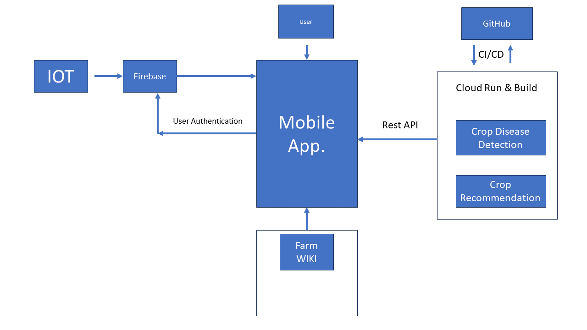

# FarmX.
FarmX is an open-source project developed for Sub-Saharan African (SSA) Farmers. It is a comprehensive solution that leverages machine learning and mobile technology to help farmers make data-driven decisions and optimize their farming operations.

#### Download FarmX APK - [here](https://drive.google.com/file/d/1yQP0Q0AToUHnF0cNFrlUkXEOwKk0Q57F/view?usp=drive_link)

## Project Structure
The project consists of Five main components that are in different folders and named accordingly.

* Crop-recommender-system: This branch contains the code for the crop-recommender system. It is a machine learning model trained on a dataset of recommended crops and soil data to recommend the best crops to farmers based on their soil composition and environmental conditions. 

* Crop-disease-detector: This branch contains the code for the crop disease detector. It is built using Python and TensorFlow, and utilizes a deep learning model (Efficientnet) trained on a large dataset of crop images to identify common crop diseases, then we provide recommendations for treatment. 

* Mobile-app: This branch contains the code for the FarmX mobile app. It is built using the Flutter framework and allows farmers to access the crop recommender system and crop disease detector from their mobile devices. The app also includes features such as a Marketplace, Order book, market prices, and a community forum for farmers to advertise, connect and sell, and a knowledgebase for farmers to read on regenerative farming techniques.

* IoT: This Branch contains all the details about the FarmX IoT device (Prototype) and full codes for reproducibility. The IoT device enables farmers to be more precise about their farm climate and soil data.

* Website: The Website features a wiki that contains blog posts and articles that farmers can use to learn new developments in agriculture and regenerative ways to farm, as well as an AI Chat Assistant powered by Gemini that can help farmers with any questions they may have.

## Getting Started

To get started with FarmX, follow these steps:

1. Clone the repository and switch to the branch you are interested in.

2. Install the requirements for the specific component you are working with.

3. Run the specific scripts or packages for the component you are working with.

## Technology Stack.

## Flow Chart.

## Contributing
Soon, We will welcome contributions to FarmX from anyone interested in helping farmers optimize their operations and improve food security. To contribute, simply fork the repository and submit a pull request with your changes.

## License
FarmX is released under the MIT License. See LICENSE for details.

